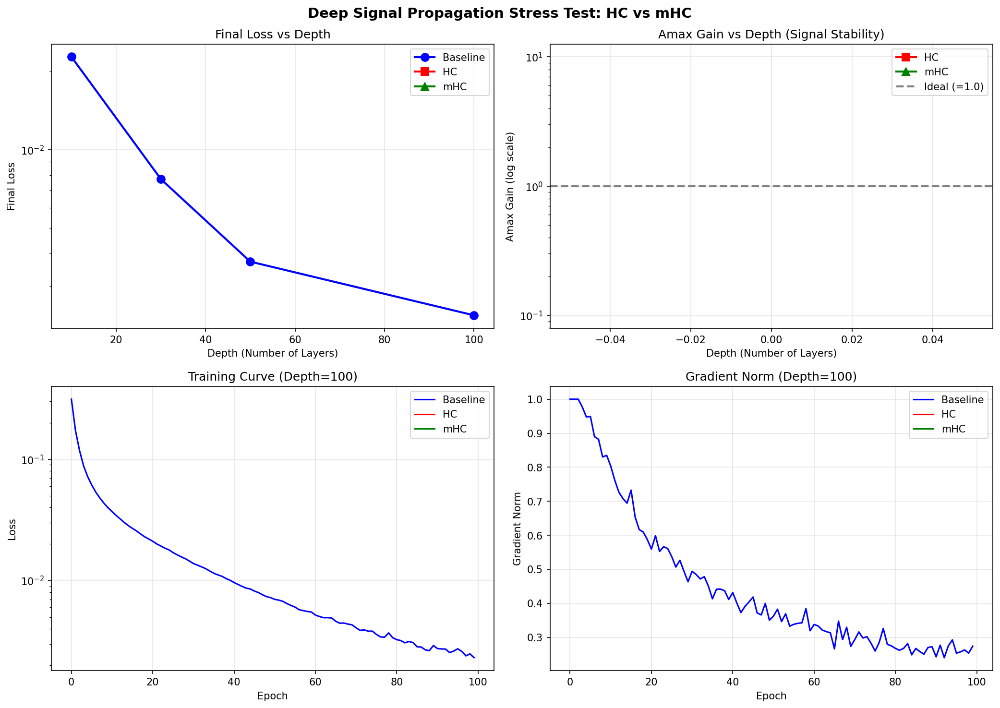

# mHC Deep Signal Propagation Test

A stress test comparing signal propagation stability in deep neural networks between **HC (Hyper-Connections)** and **mHC (Manifold-Constrained Hyper-Connections)**.

## Overview

This experiment demonstrates why the doubly stochastic matrix constraint (via Sinkhorn-Knopp algorithm) in mHC is crucial for training very deep networks.

### Key Findings

| Model | Cumulative H^res Behavior | Deep Network Stability |
|-------|---------------------------|------------------------|
| **Baseline ResNet** | N/A (standard residual) | Moderate |
| **HC (Unconstrained)** | Amax >> 1.0 (signal explosion) | Unstable |
| **mHC (Constrained)** | Amax ≈ 1.0 (signal preserved) | Stable |

## What is mHC?

mHC constrains the residual mixing matrix H^res to be a **doubly stochastic matrix** (rows and columns sum to 1). This ensures:

1. **Signal magnitude preservation**: The product of doubly stochastic matrices is also doubly stochastic
2. **No gradient explosion/vanishing**: Stable backpropagation through very deep networks
3. **Interpretable mixing**: Each stream receives a weighted combination that sums to 1

## Installation

```bash
# Using uv (recommended)
uv sync

# Or using pip
pip install torch numpy matplotlib
```

## Usage

```bash
python deep_signal_propagation_test.py
```

This will:
1. Train Baseline ResNet, HC, and mHC models at depths [10, 30, 50, 100]
2. Track loss, gradient norm, and Amax gain metrics
3. Generate `depth_scaling_results.png` visualization

## Metrics Explained

- **Final Loss**: Training loss after convergence
- **Gradient Norm**: Magnitude of gradients (indicates training stability)
- **Amax Gain**: Maximum row/column sum of cumulative H^res matrix
  - Ideal value: 1.0 (doubly stochastic)
  - Values >> 1.0 indicate signal explosion

## Results



## Requirements

- Python >= 3.13
- PyTorch >= 2.9.1
- NumPy >= 2.4.1
- Matplotlib >= 3.10.8

## References

- Hyper-Connections paper (HC)
- mHC.cu CUDA library for optimized Sinkhorn-Knopp operations

## License

MIT
